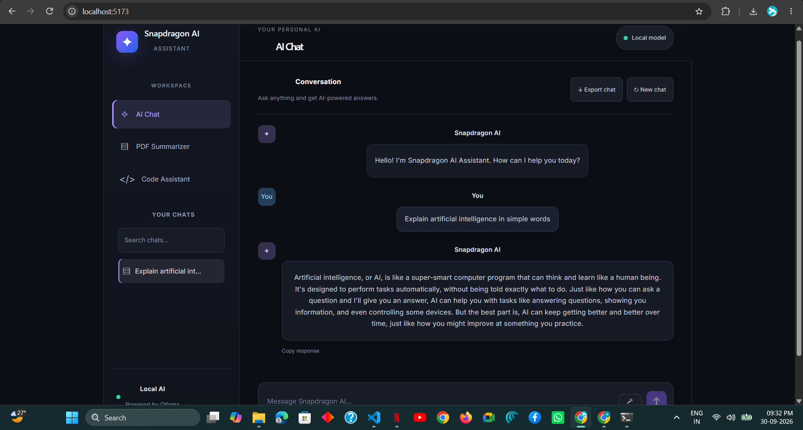
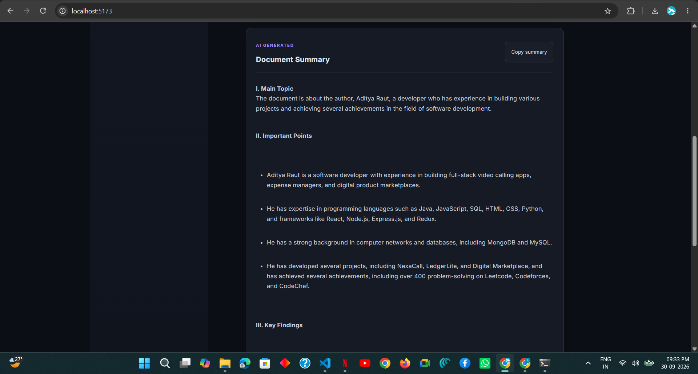
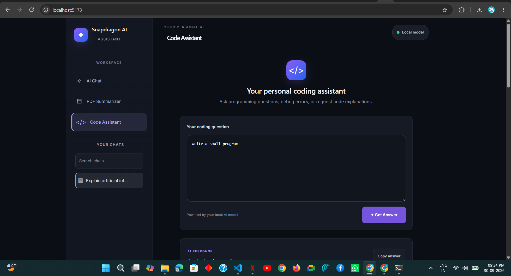
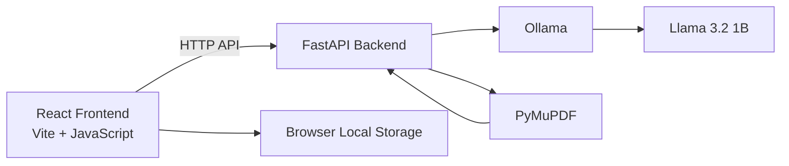

# 🧠 Snapdragon AI Assistant

> **A local-first AI assistant for chat, documents, coding, and voice interaction — powered by React, FastAPI, and Ollama.**

Snapdragon AI Assistant brings multiple AI productivity tools into one clean interface. The application uses a React frontend, a FastAPI backend, and a locally running Ollama model so the core AI workflow can run on the user's own machine.

## ✨ Highlights

| Feature | What it does |
|---|---|
| 💬 **AI Chat** | Ask questions and continue conversations with chat history |
| 📄 **PDF Summarizer** | Upload a PDF and generate a concise AI summary |
| 💻 **Code Assistant** | Get programming help, explanations, and code |
| 🎙️ **Voice Input** | Speak prompts using browser speech recognition |
| 🔎 **Chat Search** | Search saved conversations and message content |
| 🗂️ **Multiple Conversations** | Create and switch between separate chats |
| 📝 **Markdown Support** | Render formatted AI responses, tables, and code |
| 📋 **Copy Responses** | Copy AI answers directly from the interface |
| 📥 **Export Chat** | Export the active conversation as a `.txt` file |

## 🖥️ Demo

Add screenshots or a demo recording to this section.

Suggested screenshots:

```text
screenshots/
├── home.png
├── ai-chat.png
├── pdf-summary.png
├── code-assistant.png
└── voice-input.png
```

Then add them to this README using:

```markdown



```

## 🏗️ Architecture



### Request flow

1. The user interacts with the React frontend.
2. The frontend sends requests to the FastAPI backend.
3. FastAPI communicates with the local Ollama model for AI generation.
4. PDF files are processed with PyMuPDF.
5. Conversation history is stored locally in the browser.

## 🛠️ Tech Stack

### Frontend
- React
- Vite
- JavaScript
- CSS
- `react-markdown`
- `remark-gfm`

### Backend
- Python
- FastAPI
- Uvicorn
- Requests
- PyMuPDF
- Pydantic
- `python-multipart`

### AI
- Ollama
- Llama 3.2 1B

## 📁 Project Structure

```text
Snapdragon-AI-Assistant-GitHub/
├── backend/
│   ├── main.py
│   └── requirements.txt
│
├── frontend/
│   ├── public/
│   ├── src/
│   │   ├── App.jsx
│   │   ├── App.css
│   │   ├── index.css
│   │   └── main.jsx
│   ├── package.json
│   ├── package-lock.json
│   ├── index.html
│   └── vite.config.js
│
├── .gitignore
└── README.md
```

## ⚙️ Requirements

Install the following:

- Node.js and npm
- Python 3
- Ollama

## 🚀 Run Locally

### 1. Clone the repository

```bash
git clone https://github.com/aditya052003/Snapdragon-AI-Assistant.git
cd Snapdragon-AI-Assistant
```

### 2. Prepare Ollama

Make sure Ollama is installed and the model is available:

```bash
ollama pull llama3.2:1b
```

Optional test:

```bash
ollama run llama3.2:1b
```

### 3. Start the backend

Open a terminal in the project root:

```powershell
cd backend
python -m venv venv
.\venv\Scripts\Activate.ps1
pip install -r requirements.txt
uvicorn main:app --reload --port 8000
```

Backend:

```text
http://127.0.0.1:8000
```

API documentation:

```text
http://127.0.0.1:8000/docs
```

### 4. Start the frontend

Open another terminal:

```powershell
cd frontend
npm install
npm run dev
```

Open the local Vite URL shown in the terminal, usually:

```text
http://localhost:5173/
```

## 🔌 API

| Method | Endpoint | Purpose |
|---|---|---|
| `POST` | `/api/chat` | AI chat with optional conversation history |
| `POST` | `/api/summarize` | PDF upload and summarization |
| `POST` | `/api/code` | Coding assistance |

## 🧪 Local Verification

The project has been run from the clean repository copy in a local Windows development environment.

Verified application areas include:

- AI Chat
- PDF Summarization
- Code Assistant
- Voice Input
- Conversation History
- Chat Search
- Markdown Rendering
- Copy Response
- Chat Export

> **Note:** Local verification does not by itself establish hardware-specific performance or compatibility on Snapdragon devices.

## 🔐 Security & Repository Hygiene

The repository includes a `.gitignore` to keep generated or private files out of Git.

It excludes items such as:

```text
node_modules/
venv/
__pycache__/
.env
dist/
```

Do not commit passwords, API keys, private documents, or other sensitive information.

## 🎯 Project Goals

The project focuses on combining several everyday AI tasks in one local-first interface:

- Ask questions without switching tools.
- Summarize documents quickly.
- Get coding help in the same workspace.
- Use voice to interact with the assistant.
- Keep useful conversations organized and searchable.

## 📌 Current Status

**Status: Working local prototype**

The application is currently designed for local development with Ollama. Performance depends on the host machine, browser support, and the selected local model.

## 👤 Author

**Aditya Raut**

GitHub: [@aditya052003](https://github.com/aditya052003)

## 📄 License

No license has been selected for this repository yet.
